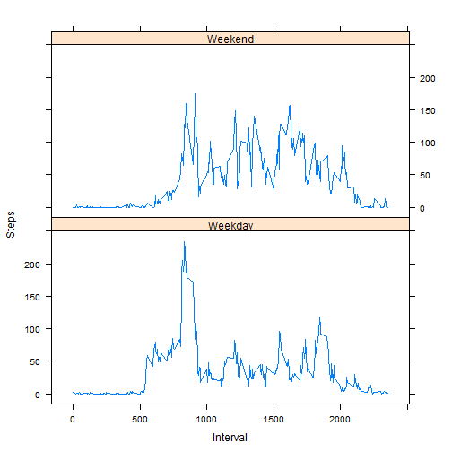

# Reproducible Research: Peer Assessment 1


## Loading and preprocessing the data

* Parse raw data


```r
rawData <- read.csv("activity.csv")
```

* Aggregate sum of steps by date and mean of steps by interval accross dates


```r
stepsByDate <- aggregate(rawData$steps,by=list(Date=rawData$date),na.rm=TRUE,FUN=sum)
names(stepsByDate) <- c("Date","Steps")
head(stepsByDate)
```

```
##         Date Steps
## 1 2012-10-01     0
## 2 2012-10-02   126
## 3 2012-10-03 11352
## 4 2012-10-04 12116
## 5 2012-10-05 13294
## 6 2012-10-06 15420
```

```r
stepsByInterval <- aggregate(rawData$steps,by=list(Date=rawData$interval),na.rm=TRUE,FUN=mean)
names(stepsByInterval) <- c("Interval","Steps")
head(stepsByInterval)
```

```
##   Interval   Steps
## 1        0 1.71698
## 2        5 0.33962
## 3       10 0.13208
## 4       15 0.15094
## 5       20 0.07547
## 6       25 2.09434
```

## What is mean total number of steps taken per day?


```r
hist(stepsByDate$Steps)
```

 


```r
mean(stepsByDate$Steps)
```

```
## [1] 9354
```

```r
median(stepsByDate$Steps)
```

```
## [1] 10395
```


## What is the average daily activity pattern?


```r
plot(stepsByInterval$Interval, stepsByInterval$Steps, type="l")
```

 

* The maximum number of average steps per interval is:


```r
stepsByInterval[stepsByInterval$Steps == max(stepsByInterval$Steps),]$Interval
```

```
## [1] 835
```


## Imputing missing values

* The number of NAs is:


```r
sum(is.na(rawData$steps))
```

```
## [1] 2304
```

* Strategy for NA replacement: substituting NAs by the mean of that day


```r
filledData <- rawData

for(i in 1:nrow(filledData)) {
  if(is.na(filledData$steps[i])) {
     filledData$steps[i] <- stepsByDate[stepsByDate$Date == filledData$date[i],]$Steps[1]
  }
}

fdSteps <- aggregate(filledData$steps,by=list(Date=filledData$interval),FUN=mean)
names(fdSteps) <- c("Interval","Steps")
head(fdSteps)
```

```
##   Interval   Steps
## 1        0 1.49180
## 2        5 0.29508
## 3       10 0.11475
## 4       15 0.13115
## 5       20 0.06557
## 6       25 1.81967
```

* Histogram, mean and median of the new data


```r
hist(fdSteps$Steps)
```

 

```r
mean(fdSteps$Steps)
```

```
## [1] 32.48
```

```r
median(fdSteps$Steps)
```

```
## [1] 29.64
```


## Are there differences in activity patterns between weekdays and weekends?


```r
rawData$Day <- weekdays(as.Date(rawData$date))
rawData$WD <- rawData$Day
for(i in 1:nrow(rawData)) {
  if(rawData$Day[i] == "Saturday" || rawData$Day[i] == "Sunday")
    rawData$WD[i] <- "Weekend"
  else
    rawData$WD[i] <- "Weekday"
}

stepsByWeekday <- aggregate(rawData$steps,by=list(Interval=rawData$interval, WD = rawData$WD),na.rm=TRUE,FUN=mean)
names(stepsByWeekday) <- c("Interval", "Weekday", "Steps")
head(stepsByWeekday)
```

```
##   Interval Weekday  Steps
## 1        0 Weekday 2.3333
## 2        5 Weekday 0.4615
## 3       10 Weekday 0.1795
## 4       15 Weekday 0.2051
## 5       20 Weekday 0.1026
## 6       25 Weekday 1.5128
```

* Plot steps by type of day


```r
library(lattice)
with(stepsByWeekday, xyplot(Steps ~ Interval | Weekday, type="l", layout=c(1,2)))
```

 
